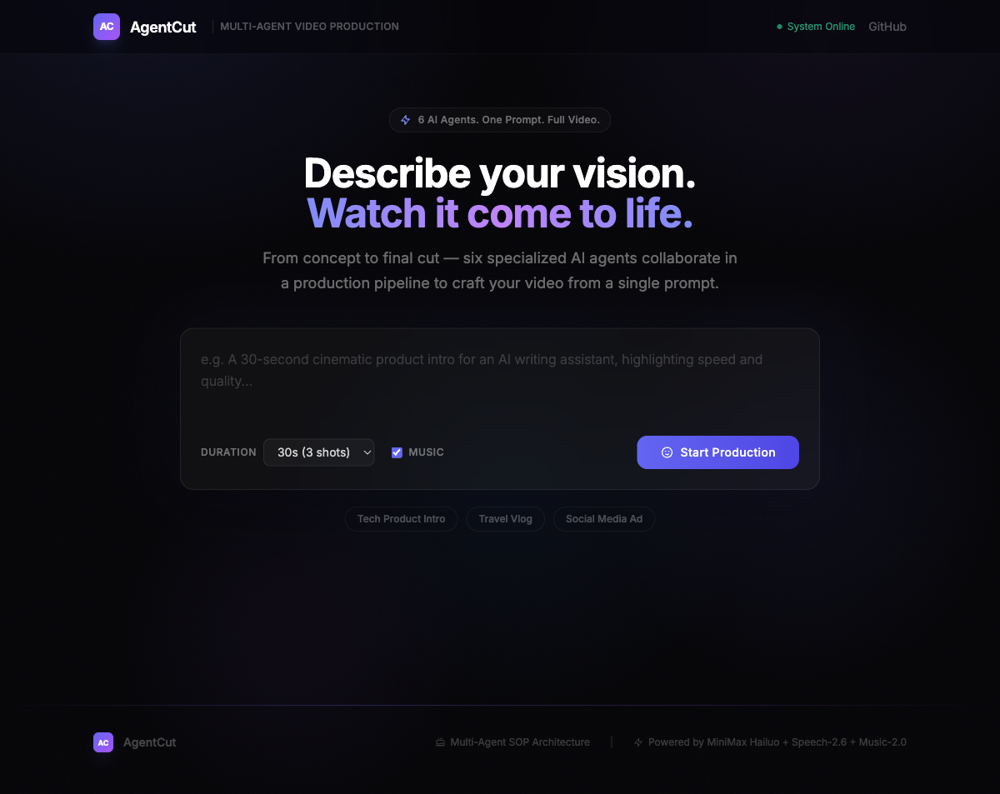
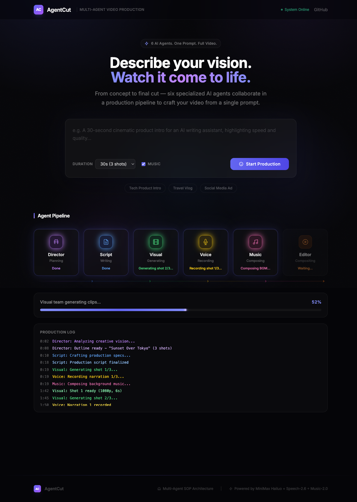

# AgentCut

[](LICENSE)
[](https://python.org)
[](Dockerfile)

Turn a text prompt into a fully produced video. 6 AI agents collaborate through a structured pipeline -- from creative direction to final cut.

<p align="center">
  
</p>

## How It Works

```
User Prompt
    |
    v
[Director Agent] -- Analyzes creative vision, plans shots
    |
    v
[Script Agent] -- Writes production script with video prompts, narration, subtitles
    |
    +------------------+------------------+
    |                  |                  |
    v                  v                  v
[Visual Agent]    [Voice Agent]     [Music Agent]
 Hailuo Video      Speech TTS        Music Gen
    |                  |                  |
    +------------------+------------------+
    |
    v
[Editor Agent] -- ffmpeg: concat, mix audio, burn subtitles
    |
    v
Final MP4
```

Visual, Voice, and Music agents run **in parallel** after the Script is ready. The Editor waits for all three, then composites the final video.

<p align="center">
  
</p>

## Features

- **Multi-agent SOP** -- 6 specialized agents, each with a single responsibility, orchestrated in a production pipeline
- **Parallel execution** -- Video, voice, and music generation run concurrently to minimize total wait time
- **Real-time progress** -- SSE streaming shows every agent's status and logs as the pipeline runs
- **One prompt, full video** -- From text description to a complete MP4 with narration, subtitles, and background music
- **~$0.50 per video** -- Typical cost for a 3-shot video using MiniMax APIs

## Tech Stack

| Component | Technology |
|-----------|-----------|
| LLM | MiniMax M1 (Director + Script agents) |
| Video | MiniMax Hailuo 2.3 (1080P, 6s clips) |
| Voice | MiniMax Speech-2.6-HD (TTS with emotion) |
| Music | MiniMax Music-2.0 (instrumental BGM) |
| Composition | ffmpeg (concat, audio mix, subtitles) |
| Backend | Python FastAPI + SSE streaming |
| Frontend | HTML + Tailwind CSS |

## Quick Start

### Prerequisites

- Python 3.10+
- ffmpeg (`brew install ffmpeg` or `apt install ffmpeg`)
- [MiniMax API key](https://www.minimax.io)

### Setup

```bash
git clone https://github.com/calderbuild/agentcut.git
cd agentcut

pip install -r backend/requirements.txt

cp .env.example .env
# Edit .env and add your MiniMax API key
```

### Run

```bash
python -m backend.main
```

Open http://localhost:8000

### Docker

```bash
cp .env.example .env
# Edit .env and add your MiniMax API key

docker compose up
```

## Usage

1. Enter a video description (e.g. "A sunset over Tokyo, cinematic aerial view")
2. Choose duration and shot count
3. Click **Start Production**
4. Watch the 6 agents work in real-time
5. Download the final MP4

## API

| Endpoint | Method | Description |
|---|---|---|
| `/api/create` | POST | Start a production job |
| `/api/stream/{job_id}` | GET | SSE event stream for progress |
| `/api/status/{job_id}` | GET | Poll job status |
| `/api/download/{job_id}` | GET | Download final video |
| `/api/health` | GET | Health check |

### Create a video

```bash
curl -X POST http://localhost:8000/api/create \
  -H "Content-Type: application/json" \
  -d '{"prompt": "A sunset over Tokyo", "duration": 18, "num_shots": 3}'
```

## Cost

Each video generation uses MiniMax API credits:
- **LLM calls** (Director + Script): ~$0.01
- **Video generation** (3 shots): ~$0.30-0.60
- **Voice TTS** (3 shots): ~$0.01
- **Music generation**: ~$0.05

Estimated total per video: **~$0.40-0.70**

## Troubleshooting

**ffmpeg subtitle filter not available**: If subtitles are not burned into the video, your ffmpeg build lacks `libass`. Install with `brew install ffmpeg` (macOS, usually includes it) or `apt install ffmpeg libass-dev` (Linux). AgentCut will still produce videos without subtitles if the filter is missing.

**API key errors**: Make sure `.env` contains a valid `MINIMAX_API_KEY`. The server will refuse to start if the key is missing.

**Video generation timeout**: Hailuo video generation can take 2-5 minutes per shot. The pipeline polls every 10 seconds with a 5-minute timeout per shot.

## Project Structure

```
backend/
  agents/
    director.py   -- Creative director: prompt -> shot outline
    script.py     -- Scriptwriter: outline -> production script
    visual.py     -- Visual artist: script -> video clips (parallel)
    voice.py      -- Voice artist: script -> narration audio
    music.py      -- Composer: style+mood -> background music
    editor.py     -- Editor: ffmpeg composition
  pipeline.py     -- Agent orchestration (parallel execution)
  main.py         -- FastAPI server + SSE streaming
  config.py       -- Configuration + validation
frontend/
  index.html      -- Single-page app with real-time pipeline UI
```

## License

[MIT](LICENSE)
